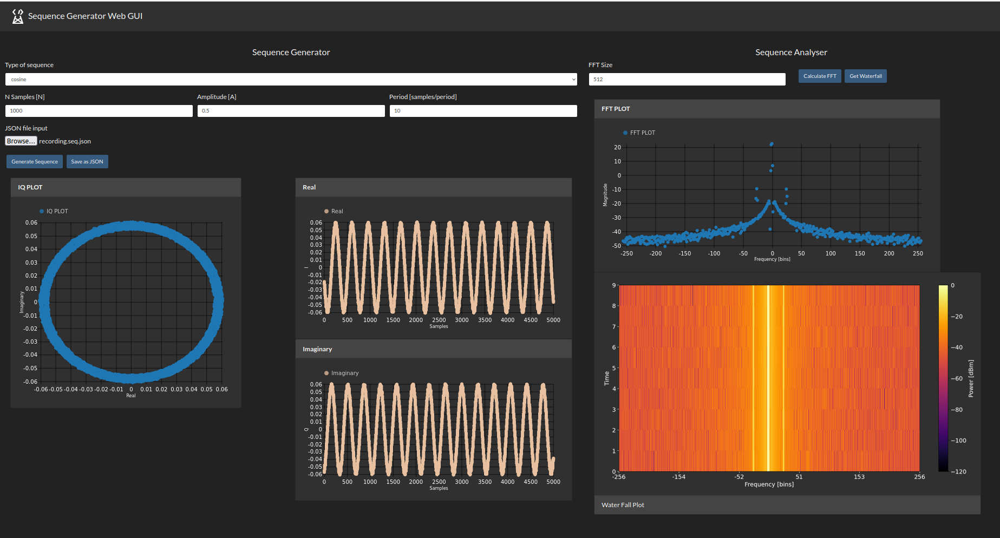

# Front-End and Back-End Implementation for HTWK sequence generator
This readme file includes the start-up instructions for running the sequence generator/analyzer.

## Back-End 
The back-end contains the different sequences and fast fourier transform calculations.
Create venv:
```bash
python3 -m venv ./env/
```
Activate env:
```bash
source env/bin/activate
```
Install requirements using pip 
```bash
pip install -r requirements.txt 
```
To run the API use the following:
```bash
uvicorn main:app --host 0.0.0.0 --reload
```
For documentation: open [This Link](http://localhost:8000/docs)

## Front-End 
if node is installed, inside the front-end directory run:
Install depandencies:
```bash
npm i
```
To start the web gui:
```bash
npm start
```



The Web GUI should be running [here](http://localhost:3000/)

